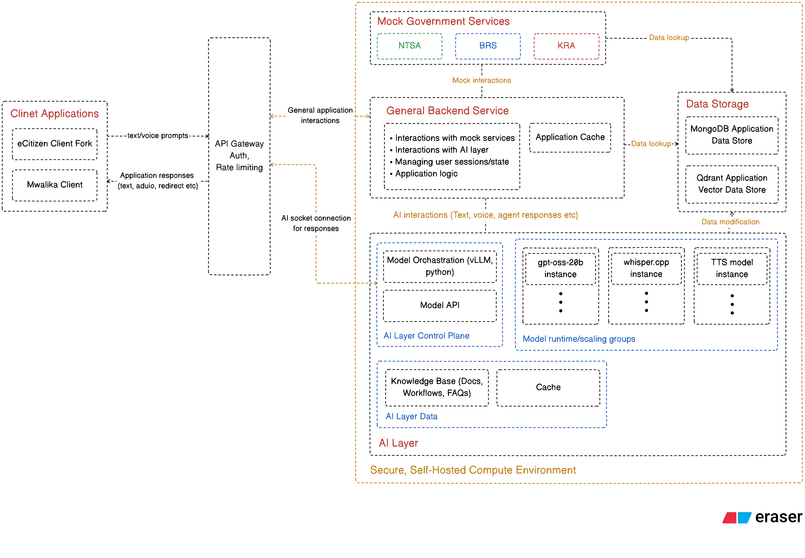
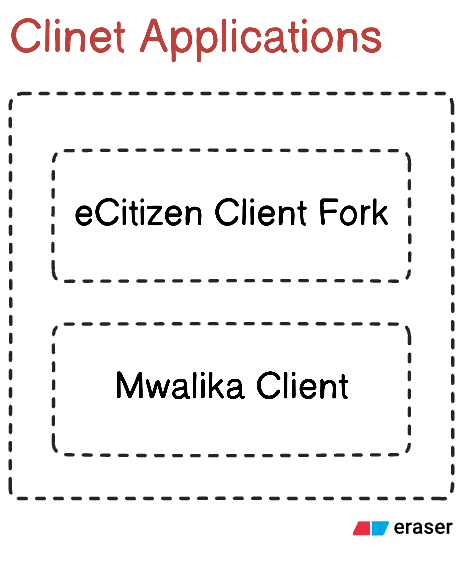
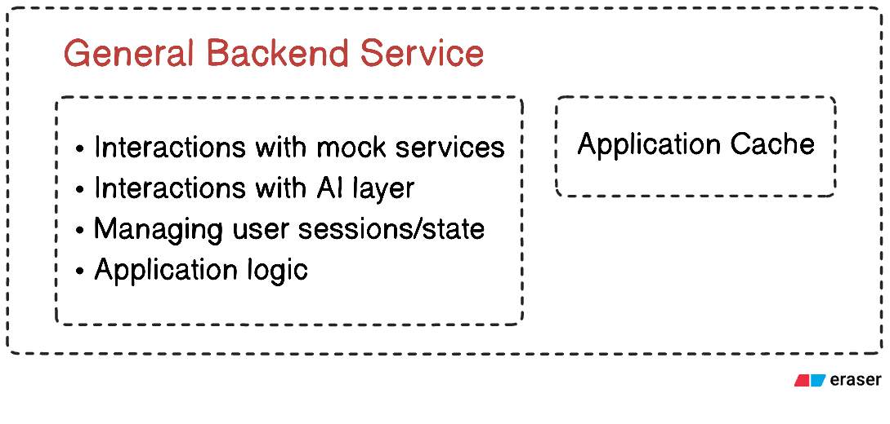
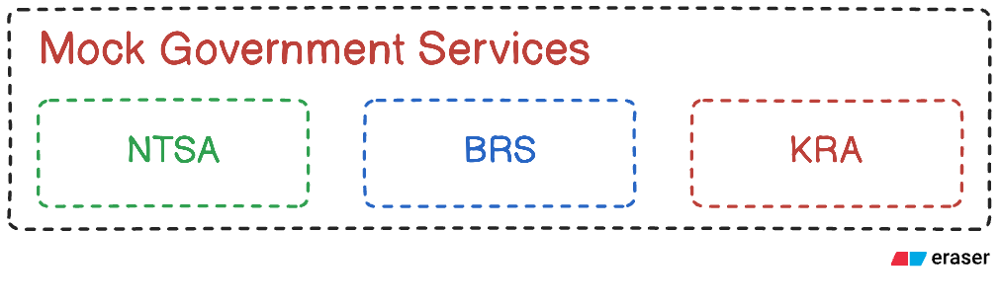
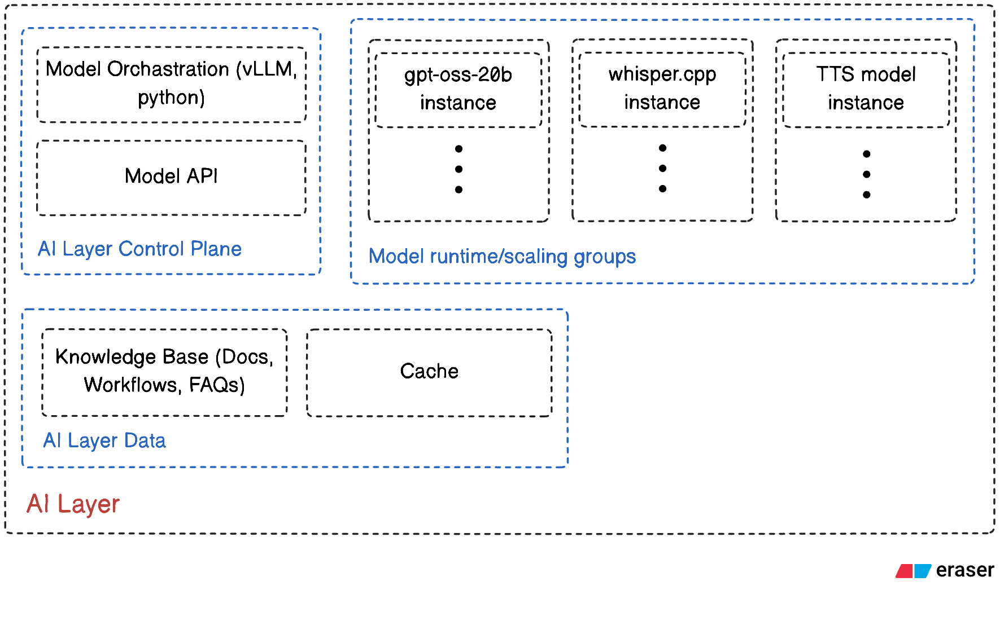
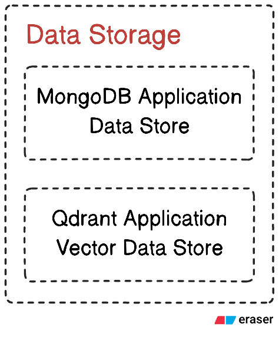

# Mwalika System Architecture Plan (MVP)

## 1. Purpose and Scope

This document outlines the **high-level system architecture** for **Mwalika**, an agentic AI
assistant designed to help Kenyan citizens navigate and interact with government services on
the eCitizen platform.

The architecture is explicitly scoped to the **MVP**, as defined in the *Proposed Solution and
MVP Scope* document. It focuses on core capabilities, scalability, security, observability, and
data governance, while remaining realistic about what is and is not implemented at this stage.

This document serves as a **practical reference during development**, not a final production
blueprint. Detailed implementation specifics such as API schemas, scaling thresholds, and
deployment configuration are captured separately in the *Technical Design and Architecture*
documentation, which will be written iteratively as development progresses.

The architecture prioritises:

- modularity and clear service boundaries,
- alignment with how a production system would be structured,
- ease of future integration with real government systems beyond the MVP.

This document should be treated as a **living artefact** until the completion of the MVP.

## 2. MVP Capabilities and Non-Goals

### 2.1 Core Capabilities

The Mwalika system architecture is designed to support the following MVP features:

1. **Conversational Assistance**  
   Natural language interaction in English and Swahili via both text and voice.

2. **Default Agent Behaviour**  
   The agent clarifies user intent, confirms assumptions, and requests minimal necessary
   information before proceeding.

3. **Government Service Assistance (Mocked)**  
   - Service discovery and redirection to relevant eCitizen pages  
   - Guided, step-by-step assistance using mock workflows  
   - Simulated agentic task execution using predefined flows

4. **General Information and FAQs**  
   A curated knowledge base is used to answer common questions about government services,
   agencies, and ministries.

5. **Web-Based User Interface**  
   A browser-based interface supporting both text and voice interactions.

6. **Privacy, Security, and Digital Sovereignty**  
   Self-hosted open source models and controlled infrastructure are used to ensure data remains
   within a defined environment.

7. **Scalability and Performance**  
   The MVP targets **up to 1,000 concurrent active sessions**, defined as WebSocket-connected
   users. Simultaneous LLM inference requests are expected to be lower and are managed through
   queuing, batching, and rate limiting to maintain acceptable performance (targeting sub-3-second
   response times under normal load).

8. **Observability and Monitoring**  
   Logging, metrics, and tracing are implemented to ensure system health and to support
   performance analysis during scaling tests.

### 2.2 Explicit Non-Goals

- **Authentication** is mocked. Demo users are assigned synthetic identities. Integration with
  eCitizen SSO or any production identity provider is out of scope for the MVP.
- **No real government submissions** are performed. All workflows are simulated.
- **No native mobile applications** are built. The MVP is web-only.

## 3. High-Level Architecture Overview

Mwalika is composed of five primary components:

1. **User Interface (UI)**
2. **General Backend Service**
3. **Mock Government Service Workflows**
4. **AI Layer**
5. **Data Storage**

Each component is:

- developed and versioned independently,
- deployed as a containerised service,
- orchestrated using **AWS EKS**.

AWS EKS acts as the orchestration layer, while EC2 instances provide the underlying compute.
GPU-enabled node groups are used where specialised hardware is required.

### 3.1 Justification for Component Choices

The selected components reflect how Mwalika would be structured in a live production
environment, even though the MVP relies on mock workflows and simulated integrations.

In a production setting:

- the UI would be part of the live eCitizen platform or a dedicated Mwalika application,
- the General Backend Service would handle real service requests and enforce policy controls,
- the AI Layer would integrate with real government APIs and databases.

The AI Layer is treated as a standalone service because it represents the core value
proposition of Mwalika. Other components exist primarily to demonstrate how this capability
would integrate into a real government system.

## 4. User Interface (Web Client)

### 4.1 Role of the UI

The User Interface is the primary interaction point between users and the system. It is
responsible for:

- capturing user input (text or voice),
- streaming requests and responses,
- rendering conversational output in a clear and accessible manner.

The UI is entirely **web-based** and accessed via a browser.

### 4.2 UI Variants

Two UI variants are supported for demonstration purposes:

- **eCitizen Forks**  
  Modified versions of existing eCitizen web portals augmented with Mwalika’s conversational
  interface, preserving the familiar look and feel of the platform.

- **Standalone Mwalika Interface**  
  A dedicated web application that exposes Mwalika’s functionality independently of eCitizen,
  used for demos and testing.

### 4.3 Interaction Modes

The UI supports:

- text input and output,
- voice input with live transcription,
- streamed AI responses,
- optional text-to-speech playback,
- visible transcripts for all voice interactions to ensure transparency and accessibility.

Voice capture uses the **MediaRecorder API**. Audio is streamed to the backend over WebSockets
for low-latency speech-to-text processing and is not persisted beyond the active session.

### 4.4 Communication Pattern

The UI communicates with backend services using:

- **REST APIs** for standard request-response interactions,
- **WebSockets** for real-time features such as token streaming, voice transcription, and
  conversational updates.

WebSocket connections are **sticky to backend pods** to preserve session consistency.

### 4.5 Implementation and Deployment

- Built using **Next.js (React with TypeScript)**.
- Deployed as a containerised service within the EKS cluster.
- Hosted on standard EC2 compute nodes, as GPU acceleration is not required.

### 4.6 Justification for UI Choices

Next.js was selected due to its maturity, strong ecosystem, and alignment with modern web
development practices. It supports both server-side and client-side rendering and mirrors the
technology stack used by the existing eCitizen platform, simplifying future integration.

The combination of REST and WebSockets provides flexibility while supporting real-time,
low-latency interactions required for conversational and voice-driven features.

## 5. General Backend Service

### 5.1 Responsibilities

The General Backend Service acts as the **orchestration and coordination layer** within the
system. It is responsible for:

- managing user sessions,
- orchestrating workflows,
- mediating access to the AI Layer,
- enforcing rate limiting and basic safeguards.

### 5.2 Core Functions

- **Session Management**  
  Demo users are issued JWTs tied to synthetic profiles. Session state is stored in MongoDB to
  allow horizontal scaling.

- **Workflow Orchestration**  
  Routes user intents to the appropriate mock workflows and manages multi-step interactions.

- **Data Handling**  
  Validates inputs, enforces basic privacy guarantees, and coordinates reads and writes across
  system components.

- **Optional Caching**  
  A shared Redis cache may be introduced to reduce latency for frequently accessed data such
  as FAQs and service metadata.

### 5.3 Technology and Deployment

- Implemented using **Node.js with TypeScript**.
- **Express.js** is used as the HTTP and WebSocket server framework for building REST APIs
  and real-time endpoints.
- Communicates with the AI Layer using REST and WebSockets.
- Deployed as a containerised service within EKS on standard EC2 nodes.

### 5.4 Justification for Backend Choices

Node.js was selected due to its event-driven architecture and suitability for handling large
numbers of concurrent connections. TypeScript improves reliability and maintainability by
introducing static typing.

Express.js provides a lightweight, widely adopted foundation for building HTTP APIs and
real-time services, with a mature ecosystem and minimal abstraction overhead.

This service-centric design allows for future expansion, clearer separation of concerns, and
simpler integration with real government systems.

## 6. Mock Government Service Workflows

### 6.1 Purpose

Mock workflows demonstrate how Mwalika would support real government services without
introducing the complexity or risk of live integrations.

They are used to:

- showcase agentic behaviour,
- validate end-to-end user journeys,
- simulate realistic service complexity.

### 6.2 Implemented Workflows

The MVP includes simulated workflows for:

- **KRA** tax return filing,
- **BRS** business registration,
- **NTSA** driving licence renewal.

All workflows are explicitly simulated and involve no real data submission.

### 6.3 Architecture and Deployment

- Implemented as a separate **Node.js + TypeScript** service.
- **Express.js** is used to expose REST APIs for workflow execution.
- Communicates with the General Backend Service via REST.
- Deployed on standard EC2 compute nodes.

### 6.4 Justification for Mock Workflow Choices

Mock workflows allow the system to demonstrate meaningful value without dependence on
external systems. The selected services are high-impact and widely used, making them ideal
examples for the MVP.

The modular design supports future replacement with real service adapters when integrations
become feasible.

## 7. AI Layer

### 7.1 Role of the AI Layer

The AI Layer provides all language and intelligence capabilities, including:

- intent understanding,
- response generation,
- speech-to-text,
- text-to-speech,
- context and knowledge retrieval.

This layer is isolated from application logic to ensure scalability and clear operational
boundaries.

### 7.2 Models and Capabilities

- **LLM: gpt-oss-20b**  
  Served using **vLLM**, quantised using QAT with MXFP4. The model is designed to operate
  within constrained VRAM budgets depending on context length and KV cache pressure.
  Responses are streamed to reduce perceived latency.

- **STT: Whisper.cpp**  
  Selected for its balance of performance, efficiency, and open source availability.

- **TTS Models**  
  Open source text-to-speech models, with final selection deferred to implementation.

### 7.3 Serving and Scaling Strategy

- LLM inference runs on **G5 instances with NVIDIA A10G GPUs**, prioritising memory bandwidth.
- STT and TTS services run on **G4dn (T4 GPU) instances**.
- Each model type is deployed as a separate scalable service within EKS.
- Scaling decisions are based on GPU utilisation, queue depth, and predefined budget limits.

When capacity limits are reached, the system degrades predictably via queuing and rate
limiting rather than failing abruptly.

### 7.4 Implementation Frameworks

- The AI Layer is implemented in **Python**.
- **FastAPI** is used to expose model inference APIs and WebSocket endpoints, providing
  high performance, async support, and clear API contracts.

### 7.5 Justification for AI Layer Choices

Python was selected due to its dominance in the AI ecosystem and rich tooling support. The
use of open source models ensures data privacy and aligns with digital sovereignty goals.

vLLM provides efficient batching and throughput optimisations, making it suitable for
serving large language models under varying load.

FastAPI provides a lightweight, high-performance framework for serving inference workloads
with both REST and WebSocket support.

## 8. Data Storage

### 8.1 Responsibilities

The Data Storage layer supports:

- session state,
- conversation metadata,
- workflow progress,
- vector embeddings for knowledge retrieval.

### 8.2 Storage Technologies

- **MongoDB**  
  Stores application data, sessions, and interaction logs.

- **Qdrant**  
  Stores vector embeddings for semantic search and context retrieval.

- **Optional Redis**  
  Used for caching if required.

All storage services are self-hosted on standard EC2 instances and accessed by services
running in EKS.

### 8.3 Justification for Data Storage Choices

MongoDB provides flexibility for semi-structured conversational data and integrates well
with Node.js. Qdrant is optimised for high-dimensional vector storage, making it suitable for
knowledge retrieval workloads.

Self-hosting these services supports the project’s data sovereignty and privacy goals.

## 9. Security and Governance (MVP)

- **Authentication**  
  Demo-only login with synthetic user identities.

- **Authorisation**  
  No fine-grained RBAC in the MVP. Planned for future iterations.

- **Data Privacy**  
  Minimal data retention and no processing of real PII.

- **Data Security**  
  HTTPS is enforced for data in transit. Encryption at rest is deferred to production.
  All resources are hosted in **af-south-1 (Cape Town)** to maintain regional data sovereignty.

## 10. Observability and Monitoring

Observability is built in to support scaling, debugging, and reliability analysis.

Key signals include:

- request and error rates,
- resource utilisation,
- WebSocket connection counts,
- LLM-specific metrics such as:
  - average tokens per second,
  - p95 response latency,
  - p95 time-to-first-token.

Tooling includes:

- **Prometheus** for metrics collection,
- **Grafana** for dashboards and visualisation,
- **Sentry** for error tracking and alerting.

Audit logs capture user interactions to support traceability and review.
